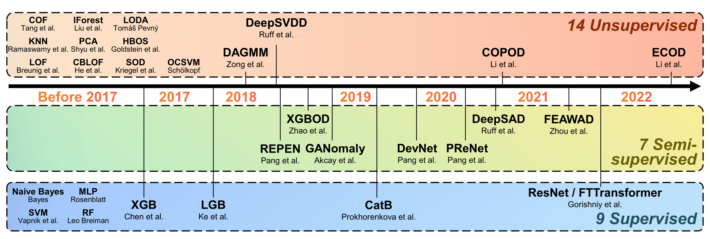

Official code and data repository of [_**ADBench**: Anomaly Detection Benchmark_](https://arxiv.org/abs/2206.09426) (NeurIPS 2022).
__Please star, watch, and fork ADBench for the active updates!__


## Citing ADBench:
Our ADBench benchmark paper is now available on [arxiv](https://arxiv.org/abs/2206.09426) and [OpenReview](https://openreview.net/forum?id=foA_SFQ9zo0).
If you find this work useful or use some our released datasets, we would appreciate citations to the following paper:
```
@inproceedings{han2022adbench,  
      title={ADBench: Anomaly Detection Benchmark},   
      author={Songqiao Han and Xiyang Hu and Hailiang Huang and Mingqi Jiang and Yue Zhao},  
      booktitle={Neural Information Processing Systems (NeurIPS)}
      year={2022},  
}
```

****

## Who Are We? ✨

ADBench is a collaborative effort between researchers at _Shanghai University of Finance and Economics (SUFE)_ and _Carnegie Mellon University (CMU)_. 
The project is designed and conducted by [Minqi Jiang (SUFE)](https://github.com/Minqi824) and [Yue Zhao (CMU)](https://github.com/yzhao062), and [Xiyang Hu (CMU)](https://github.com/xiyanghu) --the author(s) of important anomaly detection libraries, including anomaly detection for tabular ([PyOD](https://github.com/yzhao062/pyod)), time-series ([TODS](https://github.com/datamllab/tods)), and graph data ([PyGOD](https://github.com/pygod-team/pygod)). 

<a href="https://github.com/Minqi824/ADBench/graphs/contributors">
  
</a>


## Why Do You Need ADBench?

ADBench is (to our best knowledge) **the most comprehensive tabular anomaly detection benchmark**, where we analyze the performance of **30** anomaly detection algorithms on [**57 datasets**](#datasets) (where we introduced 10 new datasets). By analyzing both research needs and deployment requirements in industry,
ADBench conducts 98,436 experiments with three major angles:
 1. **the effect of supervision** (e.g., ground truth labels) 
by including 14 unsupervised, 7 semi-supervised, and 9 supervised methods;
 2. **algorithm performance under different types of anomalies** by 
simulating the environments with 4 types of anomalies; and
 3. **algorithm robustness and stability** under 3 settings of data corruptions. 

**Key Takeaways in 1 Minute**:
1. :bangbang: surprisingly none of the benchmarked unsupervised algorithms is statistically better than others, emphasizing the importance of algorithm selection;
2. :bangbang: with merely 1% labeled anomalies, most semi-supervised methods can outperform the best unsupervised method, justifying the importance of supervision;
3. in controlled environments, we observe that best unsupervised methods for specific types of anomalies are even better than semi- and fully-supervised methods, revealing the necessity of understanding data characteristics;
4. semi-supervised methods show potential in achieving robustness in noisy and corrupted data, possibly due to their efficiency in using labels and feature selection;
5. :interrobang: and many more can be found in our papers (Section 4)

The Figure below provides an overview of our proposed ADBench (see our [paper](https://arxiv.org/abs/2206.09426) for details).


----

## How to use ADBench?

We envision three primary usages of ADBench:

- **Have better understanding of anomaly detection algorithms**: please read our [paper](https://arxiv.org/abs/2206.09426) for details.
- **Conduct future research on anomaly detection**: we list 4 important future research questions in the paper--see Section 4 to see some thoughts!
- **Access rich algorithm implementation and datasets**: see details below for how to use them
- **Benchmark your anomaly detection algorithms**: see [notebook](https://github.com/Minqi824/ADBench/blob/main/demo.ipynb) for instruction.


### Dependency
The experiment code is written in Python 3 and built on a number of Python packages:  

- scikit-learn==0.20.3
- pyod==1.0.0
- Keras==2.8.0
- tensorflow==2.8.0
- torch==1.9.0
- rtdl==0.0.13
- delu
- lightgbm
- xgboost
- catboost 
- copulas

### Quickly implement ADBench for benchmarking AD algorithms.
We present the following example for quickly implementing ADBench in _three different Angles_ illustrated
in the paper. Currently, [57 datasets](#datasets) can be used for evaluating [30 algorithms](#algorithms) in ADBench,
and we encourage to test your customized datasets/algorithms in our ADBench testbed.


**_Angle I: Availability of Ground Truth Labels (Supervision)_**
```python
from data_generator import DataGenerator
from myutils import Utils

# one can use our already included datasets
data_generator = DataGenerator(dataset='6_cardio.npz')
# specify the ratio of labeled anomalies to generate X and y
# la could be any float number in [0.0, 1.0]
data = data_generator.generator(la=0.1) 

# or specify the X and y of your customized data
# data_generator = DataGenerator(dataset=None)
# data = data_generator.generator(X=X, y=y, la=0.1)

# import AD algorithms (e.g., DevNet) and initialization
from baseline.DevNet.run import DevNet
model = DevNet(seed=42)

# fitting
model.fit(X_train=data['X_train'], y_train=data['y_train'])

# prediction
score = model.predict_score(data['X_test'])

# evaluation
utils = Utils()
result = utils.metric(y_true=data['y_test'], y_score=score)
```

**_Angle II: Types of Anomalies_**
```python
# For Angle II, different types of anomalies are generated as the following
data_generator = DataGenerator(dataset='6_cardio.npz')
# the type of anomalies could be 'local', 'global', 'dependency' or 'cluster'.
data = data_generator.generator(realistic_synthetic_mode='local')
```


**_Angle III: Model Robustness with Noisy and Corrupted Data_**
```python
# For Angle III, different data noises and corruptions are added as the following
data_generator = DataGenerator(dataset='6_cardio.npz')
# the type of anomalies could be 'duplicated_anomalies', 'irrelevant_features' or 'label_contamination'.
data = data_generator.generator(noise_type='duplicated_anomalies')
```

- We also provide an example for quickly implementing ADBench, as shown in [notebook](demo.ipynb).
- For **complete results** of ADBench, please refer to our [paper](https://arxiv.org/abs/2206.09426).
- For **reproduce** experiment results of ADBench, please run the [code](run.py).

### Datasets
ADBench includes [57 datasets](https://github.com/Minqi824/ADBench/tree/main/datasets), as shown in the following Table. 

- Among them, **47 widely-used real-world datasets** are gathered for model evaluation, which cover many application domains, 
including healthcare (e.g., disease diagnosis), 
audio and language processing (e.g., speech recognition), 
image processing (e.g., object identification), 
finance (e.g., financial fraud detection), etc.  

- we introduce **10 more complex datasets** from CV and NLP domains with more samples and richer features in ADBench.
Pretrained models are applied to extract data embedding from NLP and CV datasets to access more complex representation.
Please see the [datasets](datasets) folder and our [paper]((https://arxiv.org/abs/2206.09426)) for detailed information.

- We organize the above 57 datasets into user-friendly format. All the datasets are named as "number_data.npz" in the
[datasets](datasets) folder. For example, one can evaluate AD algorithms on the cardio dataset by the following codes.
For multi-class dataset like CIFAR10, additional class numbers should be specified as "number_data_class.npz".
Please see the folder for more details.

- We provide the data processing code [for NLP datasets](https://colab.research.google.com/drive/1uMr_5jIqrlP1UL1SlBm7cdO7fmDaEamB?usp=sharing)
and [for CV datasets](https://colab.research.google.com/drive/1tB90CB-BuKDOM3WYV75-WkK6xrMQxQ5M?usp=sharing)
in **Google Colab**, where one can quickly
reproduce our procedures via the free GPUs. We hope this could be helpful for the AD community.

We have unified all the datasets in .npz format, and you can read a dataset by the following script

```python
import numpy as np
data = np.load('6_cardio.npz', allow_pickle=True)
X, y = data['X'], data['y']
```

| Number | Data | # Samples | # Features | # Anomaly | % Anomaly | Category |
|:--:|:---:|:---------:|:----------:|:---------:|:---------:|:---:|
|1| ALOI                    |   49534   |     27     |   1508    |   3.04    |     Image     |
|2| annthyroid   |   7200    |     6      |    534    |   7.42    |      Healthcare    |
|3| backdoor|   95329   |    196     |   2329    |   2.44    | Network|
|4| breastw                              |    683    |     9      |    239    |   34.99   | Healthcare  |
|5|campaign|   41188   |     62     |   4640    |   11.27   | Finance|
|6| cardio                               |   1831    |     21     |    176    |   9.61    | Healthcare |        
|7| Cardiotocography    |   2114    |     21     |    466    |   22.04   | Healthcare         |
|8|celeba|  202599   |     39     |   4547    |   2.24    | Image|
|9|census|  299285   |    500     |   18568   |   6.20    | Sociology|
|10| cover                                |  286048   |     10     |   2747    |   0.96    | Botany    | 
|11|donors|  619326   |     10     |   36710   |   5.93    | Sociology|
|12| fault                      |   1941    |     27     |    673    |   34.67   | Physical         |
|13|fraud|  284807   |     29     |    492    |   0.17    | Finance|
|14| glass |    214    |     7      |     9     |   4.21    | Forensic          |
|15| Hepatitis           |    80     |     19     |    13     |   16.25   | Healthcare         |
|16| http                                 |  567498   |     3      |   2211    |   0.39    | Web   |      
|17| InternetAds   |   1966    |    1555    |    368    |   18.72   | Image         |
|18| Ionosphere        |    351    |     32     |    126    |   35.90   | Oryctognosy         |
|19| landsat                         |   6435    |     36     |   1333    |   20.71   | Astronautics    |     
|20| letter                               |   1600    |     32     |    100    |   6.25    | Image     |    
|21| Lymphography       |    148    |     18     |     6     |   4.05    | Healthcare       |  
|22| magic.gamma                     |   19020   |     10     |   6688    |   35.16   | Physical        | 
|23| mammography                          |   11183   |     6      |    260    |   2.32    | Healthcare  |       
|24| mnist                                |   7603    |    100     |    700    |   9.21    | Image      |   
|25| musk                                 |   3062    |    166     |    97     |   3.17    | Chemistry   |      
|26| optdigits                            |   5216    |     64     |    150    |   2.88    | Image     |    
|27| PageBlocks         |   5393    |     10     |    510    |   9.46    | Document         |
|28| pendigits                            |   6870    |     16     |    156    |   2.27    | Image        | 
|29| Pima                |    768    |     8      |    268    |   34.90   | Healthcare         |
|30| satellite                            |   6435    |     36     |   2036    |   31.64   | Astronautics     |    
|31| satimage-2                           |   5803    |     36     |    71     |   1.22    | Astronautics    |     
|32| shuttle                              |   49097   |     9      |   3511    |   7.15    | Astronautics  |       
|33| skin                            |  245057   |     3      |   50859   |   20.75   |    Image      |
|34| smtp                                 |   95156   |     3      |    30     |   0.03    | Web        | 
|35| SpamBase            |   4207    |     57     |   1679    |   39.91   | Document         |
|36| speech                               |   3686    |    400     |    61     |   1.65    | Linguistics    |     
|37| Stamps              |    340    |     9      |    31     |   9.12    | Document         |
|38| thyroid                              |   3772    |     6      |    93     |   2.47    | Healthcare      |   
|39| vertebral                            |    240    |     6      |    30     |   12.50   | Biology       |  
|40| vowels                               |   1456    |     12     |    50     |   3.43    | Linguistics  |       
|41| Waveform           |   3443    |     21     |    100    |   2.90    | Physics         |
|42| WBC                |    223    |     9      |    10     |   4.48    | Healthcare         |
|43| WDBC               |    367    |     30     |    10     |   2.72    | Healthcare         |
|44| Wilt                |   4819    |     5      |    257    |   5.33    | Botany         |
|45| wine                                 |    129    |     13     |    10     |   7.75    | Chemistry   |      
|46| WPBC             |    198    |     33     |    47     |   23.74   | Healthcare   |      
|47| yeast                           |   1484    |     8      |    507    |   34.16   | Biology|
|48| CIFAR10| 5263 |    512    |    263     |   5.00    |   Image   |
|49| FashionMNIST| 6315|    512    |    315     |   5.00    |   Image   |
|50| MNIST-C| 10000|    512    |    500     |   5.00    |   Image   |
|51| MVTec-AD| See Table B2. |       |          |       |   Image   |
|52| SVHN| 5208 |512| 260 |5.00 |Image |
|53| Agnews| 10000 |768 |500 |5.00| NLP |
|54| Amazon| 10000 |768| 500 |5.00| NLP |
|55| Imdb| 10000| 768| 500 |5.00 |NLP |
|56| Yelp| 10000| 768| 500 |5.00| NLP |
|57| 20newsgroups| See Table B3. |     |          |       |   NLP   |

### Algorithms
Compared to the previous benchmark studies, we have a larger algorithm collection with
1. latest unsupervised AD algorithms like DeepSVDD and ECOD;
2. SOTA semi-supervised algorithms, including DeepSAD and DevNet;
3. latest network architectures like ResNet in computer vision (CV) and Transformer in natural language processing (NLP) domain
---we adapt ResNet and FTTransformer models for tabular AD in the proposed ADBench; and
4. ensemble learning methods like LightGBM, XGBoost, and CatBoost.
The Figure below shows the algorithms (14 unsupervised, 7 semi-supervised, and 9 supervised algorithms) in ADBench.


For each algorithm, we also introduce its specific implementation in the following Table.
The only thing worth noting is that model name should be specified 
(especially for those models deployed by their corresponding package, e.g., [PyOD](https://github.com/yzhao062/pyod)). 
The following codes show the example to import AD models. 
Please see the Table for complete AD models included in ADBench and their import methods.

```python
from baseline.PyOD import PYOD
model = PYOD(model_name='XGBOD') # initialization
model.fit(X_train, y_train) # fit
score = model.predict_score(X_test) # predict
```

|  Model  | Year | Type |  DL  |       Import       |  Source  |
| :-----: | :--------: | :--: | :--: | :-----------------: | :------: |
| [PCA](https://apps.dtic.mil/sti/pdfs/ADA465712.pdf) | Before 2017 | Unsup |  &cross;   | from baseline.PyOD import PYOD | [Link](https://pyod.readthedocs.io/en/latest/#) |
| [OCSVM](https://proceedings.neurips.cc/paper/1999/file/8725fb777f25776ffa9076e44fcfd776-Paper.pdf) | Before 2017  | Unsup |  &cross;   | from baseline.PyOD import PYOD | [Link](https://pyod.readthedocs.io/en/latest/#) |
| [LOF](https://dl.acm.org/doi/pdf/10.1145/342009.335388) | Before 2017  | Unsup |  &cross;   | from baseline.PyOD import PYOD | [Link](https://pyod.readthedocs.io/en/latest/#) |
| [CBLOF](https://www.sciencedirect.com/science/article/abs/pii/S0167865503000035?casa_token=8zegN8osm64AAAAA:mf8lhwsCXHslgL8eYYJUSKJYgSiy42ibf6aMrP-zlaKE5tz_hiy63Olqv_NGAM7Gz21pjCTuMA) | Before 2017  | Unsup |  &cross;   | from baseline.PyOD import PYOD | [Link](https://pyod.readthedocs.io/en/latest/#) |
| [COF](https://link.springer.com/chapter/10.1007/3-540-47887-6_53) | Before 2017  | Unsup |  &cross;   | from baseline.PyOD import PYOD | [Link](https://pyod.readthedocs.io/en/latest/#) |
| [HBOS](http://citeseerx.ist.psu.edu/viewdoc/download?doi=10.1.1.401.5686&rep=rep1&type=pdf) | Before 2017  | Unsup |  &cross;   | from baseline.PyOD import PYOD | [Link](https://pyod.readthedocs.io/en/latest/#) |
| [KNN](https://dl.acm.org/doi/pdf/10.1145/342009.335437) | Before 2017  | Unsup |  &cross;   | from baseline.PyOD import PYOD | [Link](https://pyod.readthedocs.io/en/latest/#) |
| [SOD](https://www.dbs.ifi.lmu.de/~zimek/publications/PAKDD2009/pakdd09-SOD.pdf) | Before 2017  | Unsup |  &cross;   | from baseline.PyOD import PYOD | [Link](https://pyod.readthedocs.io/en/latest/#) |
| [COPOD](https://arxiv.org/abs/2009.09463) | 2020  | Unsup |  &cross;   | from baseline.PyOD import PYOD | [Link](https://pyod.readthedocs.io/en/latest/#) |
| [ECOD](https://arxiv.org/abs/2201.00382) | 2022  | Unsup |  &cross;   | from baseline.PyOD import PYOD | [Link](https://pyod.readthedocs.io/en/latest/#) |
| [IForest†](https://cs.nju.edu.cn/zhouzh/zhouzh.files/publication/icdm08b.pdf?q=isolation-forest) | Before 2017  | Unsup |  &cross;   | from baseline.PyOD import PYOD | [Link](https://pyod.readthedocs.io/en/latest/#) |
| [LODA†](https://link.springer.com/article/10.1007/s10994-015-5521-0) | Before 2017  | Unsup |  &cross;   | from baseline.PyOD import PYOD | [Link](https://pyod.readthedocs.io/en/latest/#) |
| [DeepSVDD](http://proceedings.mlr.press/v80/ruff18a/ruff18a.pdf) | 2018  | Unsup |  &check;   | from baseline.PyOD import PYOD | [Link](https://pyod.readthedocs.io/en/latest/#) |
| [DAGMM](https://openreview.net/forum?id=BJJLHbb0-) | 2018  | Unsup |  &check;   | from baseline.DAGMM.run import DAGMM | [Link](https://github.com/mperezcarrasco/PyTorch-DAGMM) |
| [GANomaly](https://arxiv.org/abs/1805.06725) | 2018  | Semi |  &check;   | from baseline.GANomaly.run import GANomaly | [Link](https://github.com/samet-akcay/ganomaly) |
| [XGBOD†](https://arxiv.org/abs/1912.00290) | 2018  | Semi |  &cross;   | from baseline.PyOD import PYOD | [Link](https://pyod.readthedocs.io/en/latest/#) |
| [DeepSAD](https://arxiv.org/abs/1906.02694) | 2019  | Semi |  &check;   | from baseline.DeepSAD.src.run import DeepSAD | [Link](https://github.com/lukasruff/Deep-SAD-PyTorch) |
| [REPEN](https://arxiv.org/abs/1806.04808) | 2018  | Semi |  &check;   | from baseline.REPEN.run import REPEN | [Link](https://github.com/GuansongPang/deep-outlier-detection) |
| [DevNet](https://arxiv.org/abs/1911.08623) | 2019  | Semi |  &check;   | from baseline.DevNet.run import DevNet | [Link](https://github.com/GuansongPang/deviation-network) |
| [PReNet](https://arxiv.org/abs/1910.13601) | 2020  | Semi |  &check;   | from baseline.PReNet.run import PReNet | / |
| [FEAWAD](https://arxiv.org/abs/2105.10500) | 2021  | Semi |  &check;   | from baseline.FEAWAD.run import FEAWAD | [Link](https://github.com/yj-zhou/Feature_Encoding_with_AutoEncoders_for_Weakly-supervised_Anomaly_Detection/blob/main/FEAWAD.py) |
| [NB](https://www.cs.unb.ca/~hzhang/publications/FLAIRS04ZhangH.pdf) | Before 2017  | Sup |  &cross;   | from baseline.Supervised import supervised | [Link](https://scikit-learn.org/stable/supervised_learning.html) |
| [SVM](http://citeseer.ist.psu.edu/viewdoc/summary?doi=10.1.1.41.1639) | Before 2017  | Sup |  &cross;   | from baseline.Supervised import supervised | [Link](https://scikit-learn.org/stable/supervised_learning.html) |
| [MLP](https://files.eric.ed.gov/fulltext/ED294889.pdf) | Before 2017  | Sup |  &check;   | from baseline.Supervised import supervised | [Link](https://scikit-learn.org/stable/supervised_learning.html) |
| [RF†](https://www.stat.berkeley.edu/~breiman/randomforest2001.pdf) | Before 2017  | Sup |  &cross;   | from baseline.Supervised import supervised | [Link](https://scikit-learn.org/stable/supervised_learning.html) |
| [LGB†](https://proceedings.neurips.cc/paper/2017/file/6449f44a102fde848669bdd9eb6b76fa-Paper.pdf) | 2017  | Supervised |  &cross;   | from baseline.Supervised import supervised | [Link](https://lightgbm.readthedocs.io/en/latest/) |
| [XGB†](https://arxiv.org/abs/1603.02754) | Before 2017  | Sup |  &cross;   | from baseline.Supervised import supervised | [Link](https://catboost.ai/en/docs/) |
| [CatB†](https://arxiv.org/pdf/1706.09516.pdf) | 2019  | Sup |  &cross;   | from baseline.Supervised import supervised | [Link](https://xgboost.readthedocs.io/en/stable/) |
| [ResNet](https://arxiv.org/pdf/2106.11959.pdf) | 2019  | Sup |  &check;   | from baseline.FTTransformer.run import FTTransformer | [Link](https://yura52.github.io/rtdl/stable/index.html) |
| [FTTransformer](https://arxiv.org/pdf/2106.11959.pdf) | 2019  | Sup |  &check;   | from baseline.FTTransformer.run import FTTransformer | [Link](https://yura52.github.io/rtdl/stable/index.html) |
- '†' marks ensembling. This symbol is not included in the model name.
- Un-, semi-, and fully-supervised methods are denoted as _unsup_, _semi_ and _sup_, respectively.
