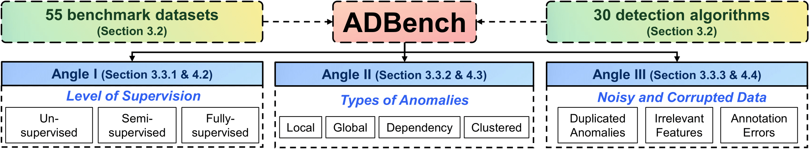
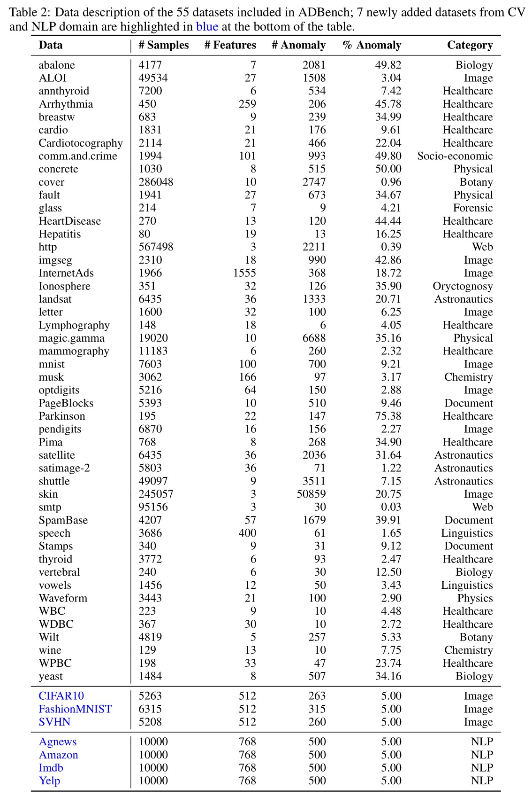

Official implementation of _**ADBench**: Anomaly Detection Benchmark_.
****


### Introduction
ADBench is (to our best knowledge) the most comprehensive tabular anomaly detection benchmark.
By analyzing both research needs and deployment requirements in industry,
ADBench covers the experiments with three major angles in anomaly detection:
_(i)_ the availability of supervision (e.g., ground truth labels) 
by including 14 unsupervised, 7 semi-supervised, and 9 supervised methods;
_(ii)_ algorithm performance under different types of anomalies by 
simulating the environments with 4 types of anomalies; and
_(iii)_ algorithm robustness and stability under 3 settings of data corruptions. 
The Figure below provides an overview of our proposed ADBench.


### Dependency
The experiment code is written in Python 3 and built on a number of Python packages:  
- scikit-learn==0.20.3 
- pyod==0.9.8 
- Keras==2.3.0 
- tensorflow==1.15.0 
- torch==1.9.0

Batch installation is possible using the supplied "requirements.txt":
```angular2html
pip install -r requirements.txt
```


### Datasets


### Algorithms


## Results


## Quickly implement ADBench for benchmarking AD algorithms.


  ### Quickly Implement ADBench for Your Customized Algorithm
    run_customized.ipynb
    
  ### Reproduce the Results in Our Papers
    run.py

  ### Supported Benchmark Algorithms (continuous updating...)
|  Model  | Paper/Year | Type |  DL  |       Import        |  Source  |
| :-----: | :--------: | :--: | :--: | :-----------------: | :------: |
| [MCD]() | xxx, xxx  | Unsupervised |  &cross;   | from baseline.PyOD import PYOD | [Link](https://pyod.readthedocs.io/en/latest/#) |
| [PCA]() | xxx, xxx  | Unsupervised |  &cross;   | from baseline.PyOD import PYOD | [Link](https://pyod.readthedocs.io/en/latest/#) |
| [OCSVM]() | xxx, xxx  | Unsupervised |  &cross;   | from baseline.PyOD import PYOD | [Link](https://pyod.readthedocs.io/en/latest/#) |
| [LOF]() | xxx, xxx  | Unsupervised |  &cross;   | from baseline.PyOD import PYOD | [Link](https://pyod.readthedocs.io/en/latest/#) |
| [CBLOF]() | xxx, xxx  | Unsupervised |  &cross;   | from baseline.PyOD import PYOD | [Link](https://pyod.readthedocs.io/en/latest/#) |
| [COF]() | xxx, xxx  | Unsupervised |  &cross;   | from baseline.PyOD import PYOD | [Link](https://pyod.readthedocs.io/en/latest/#) |
| [HBOS]() | xxx, xxx  | Unsupervised |  &cross;   | from baseline.PyOD import PYOD | [Link](https://pyod.readthedocs.io/en/latest/#) |
| [KNN]() | xxx, xxx  | Unsupervised |  &cross;   | from baseline.PyOD import PYOD | [Link](https://pyod.readthedocs.io/en/latest/#) |
| [SOD]() | xxx, xxx  | Unsupervised |  &cross;   | from baseline.PyOD import PYOD | [Link](https://pyod.readthedocs.io/en/latest/#) |
| [COPOD](https://arxiv.org/abs/2009.09463) | ICDM, 2020  | Unsupervised |  &cross;   | from baseline.PyOD import PYOD | [Link](https://pyod.readthedocs.io/en/latest/#) |
| [ECOD](https://arxiv.org/abs/2201.00382) | TKDE, 2022  | Unsupervised |  &cross;   | from baseline.PyOD import PYOD | [Link](https://pyod.readthedocs.io/en/latest/#) |
| [IForest*]() | xxx, xxx  | Unsupervised |  &cross;   | from baseline.PyOD import PYOD | [Link](https://pyod.readthedocs.io/en/latest/#) |
| [FeatureBagging*]() | xxx, xxx  | Unsupervised |  &cross;   | from baseline.PyOD import PYOD | [Link](https://pyod.readthedocs.io/en/latest/#) |
| [LSCP*]() | xxx, xxx  | Unsupervised |  &cross;   | from baseline.PyOD import PYOD | [Link](https://pyod.readthedocs.io/en/latest/#) |
| [LODA*]() | xxx, xxx  | Unsupervised |  &cross;   | from baseline.PyOD import PYOD | [Link](https://pyod.readthedocs.io/en/latest/#) |
| [SOGAAL](https://arxiv.org/pdf/1809.10816.pdf) | TKDE, 2019  | Unsupervised |  &check;   | from baseline.PyOD import PYOD | [Link](https://pyod.readthedocs.io/en/latest/#) |
| [MOGAAL*](https://arxiv.org/pdf/1809.10816.pdf) | TKDE, 2019  | Unsupervised |  &check;   | from baseline.PyOD import PYOD | [Link](https://pyod.readthedocs.io/en/latest/#) |
| [DAGMM](https://openreview.net/forum?id=BJJLHbb0-) | ICLR, 2018  | Unsupervised |  &check;   | from baseline.DAGMM.run import DAGMM | [Link](https://github.com/mperezcarrasco/PyTorch-DAGMM) |
| [AutoEncoder]() | xxx, xxx  | Semi-supervised^ |  &check;   | from baseline.PyOD import PYOD | [Link](https://pyod.readthedocs.io/en/latest/#) |
| [GANomaly](https://arxiv.org/abs/1805.06725) | ACCV, 2018  | Semi-supervised^ |  &check;   | from baseline.GANomaly.run import GANomaly | [Link]() |
| [XGBOD](https://arxiv.org/abs/1912.00290) | IJCNN, 2018  | Semi-supervised |  &cross;   | from baseline.PyOD import PYOD | [Link](https://pyod.readthedocs.io/en/latest/#) |
| [DeepSAD](https://arxiv.org/abs/1906.02694) | ICLR, 2019  | Semi-supervised |  &check;   | from baseline.DeepSAD.src.run import DeepSAD | [Link](https://github.com/lukasruff/Deep-SAD-PyTorch) |
| [REPEN](https://arxiv.org/abs/1806.04808) | KDD, 2018  | Weakly-supervised |  &check;   | from baseline.REPEN.run import REPEN | [Link]() |
| [DevNet](https://arxiv.org/abs/1911.08623) | KDD, 2019  | Weakly-supervised |  &check;   | from baseline.DevNet.run import DevNet | [Link](https://github.com/GuansongPang/deviation-network) |
| [PReNet](https://arxiv.org/abs/1910.13601) | arxiv, 2020  | Weakly-supervised |  &check;   | from baseline.PReNet.run import PReNet | [Link]() |
| [FEAWAD](https://arxiv.org/abs/2105.10500) | TNNLS, 2021  | Weakly-supervised |  &check;   | from baseline.FEAWAD.run import FEAWAD | [Link](https://github.com/yj-zhou/Feature_Encoding_with_AutoEncoders_for_Weakly-supervised_Anomaly_Detection/blob/main/FEAWAD.py) |
| [LR]() | xxx, xxx  | Supervised |  &cross;   | from baseline.Supervised import supervised | [Link]() |
| [NB]() | xxx, xxx  | Supervised |  &cross;   | from baseline.Supervised import supervised | [Link]() |
| [SVM]() | xxx, xxx  | Supervised |  &cross;   | from baseline.Supervised import supervised | [Link]() |
| [MLP]() | xxx, xxx  | Supervised |  &check;   | from baseline.Supervised import supervised | [Link]() |
| [RF](https://www.stat.berkeley.edu/~breiman/randomforest2001.pdf) | xxx, xxx  | Supervised |  &cross;   | from baseline.Supervised import supervised | [Link]() |
| [LGB](https://proceedings.neurips.cc/paper/2017/file/6449f44a102fde848669bdd9eb6b76fa-Paper.pdf) | NIPS, 2017  | Supervised |  &cross;   | from baseline.Supervised import supervised | [Link](https://lightgbm.readthedocs.io/en/latest/) |
| [XGB](https://arxiv.org/abs/1603.02754) | KDD, 2016  | Supervised |  &cross;   | from baseline.Supervised import supervised | [Link](https://xgboost.readthedocs.io/en/stable/) |
| [ResNet](https://arxiv.org/pdf/2106.11959.pdf) | NIPS, 2019  | Supervised |  &check;   | from baseline.FTTransformer.run import FTTransformer | [Link](https://yura52.github.io/rtdl/stable/index.html) |
| [FTTransformer](https://arxiv.org/pdf/2106.11959.pdf) | NIPS, 2019  | Supervised |  &check;   | from baseline.FTTransformer.run import FTTransformer | [Link](https://yura52.github.io/rtdl/stable/index.html) |
- '*' denotes that this model is ensembled.
- '^' denotes that this semi-supervised model only uses normal samples in the training stage.

