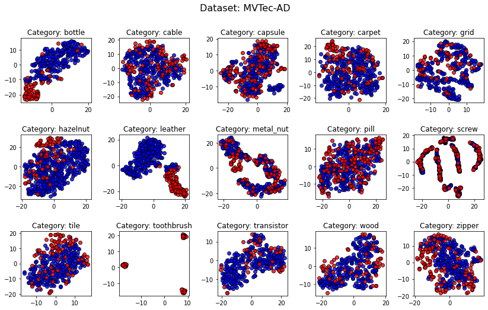

### Overview
In addition to the tabular benchmark datasets provided in [classical directory](https://github.com/Minqi824/ADBench/tree/main/datasets/Classical).
We provide more details on the generation of the 10 CV/NLP datasets as below.

In a nutshell, pretrained models are applied to extract data embedding
from CV and NLP datasets to access more complex representations, which has been widely used in
AD literature [1,2,3]. Please refer to Section 3.2 and Appx. B.1 for details.

### Adapted CV and NLP Datasets for Tabular AD

For the **CV** datasets, we provide two versions of transformed embedding data
for evaluating tabular-based AD algorithms (codes are available in [colab](https://colab.research.google.com/drive/1tB90CB-BuKDOM3WYV75-WkK6xrMQxQ5M?usp=sharing)):
- [ImageNet-pretrained ResNet-18](https://pytorch.org/hub/pytorch_vision_resnet/) to extract the embedding after the last average pooling layer. See [Data Folder](https://github.com/Minqi824/ADBench/tree/main/datasets/CV_by_ResNet18).
- [ImageNet-pretrained ViT](https://github.com/lukemelas/PyTorch-Pretrained-ViT) to extract the embedding after the last average pooling layer. See [Data Folder](https://github.com/Minqi824/ADBench/tree/main/datasets/CV_by_ViT).


For the **NLP** datasets, we provide two versions of transformed embedding data (codes are available in [colab](https://colab.research.google.com/drive/1uMr_5jIqrlP1UL1SlBm7cdO7fmDaEamB?usp=sharing))
- [Pretrained BERT](https://huggingface.co/bert-base-uncased) to extract the embedding of the [CLS] token. See [Data Folder](https://github.com/Minqi824/ADBench/tree/main/datasets/NLP_by_BERT).
- [Pretrained RoBERTa](https://huggingface.co/roberta-base) to extract the embedding of the [CLS] token. See [Data Folder](https://github.com/Minqi824/ADBench/tree/main/datasets/NLP_by_RoBERTa).


### Raw Data File Download

CV datasets:
- CIFAR10: https://pytorch.org/vision/stable/generated/torchvision.datasets.CIFAR10.html
- FashionMNIST: https://pytorch.org/vision/stable/generated/torchvision.datasets.FashionMNIST.html#torchvision.datasets.FashionMNIST
- MNIST-C: https://zenodo.org/record/3239543
- MVTec-AD: https://www.mvtec.com/company/research/datasets/mvtec-ad
- SVHN: https://pytorch.org/vision/stable/generated/torchvision.datasets.SVHN.html#torchvision.datasets.SVHN

NLP datasets:
- Agnews: https://huggingface.co/datasets/ag_news
- Amazon: https://huggingface.co/datasets/amazon_polarity
- Imdb: https://huggingface.co/datasets/imdb
- Yelp: https://huggingface.co/datasets/yelp_review_full
- 20newsgroups: http://qwone.com/~jason/20Newsgroups/

****
Here we demonstrate the MVTec-AD data embedded by the pretrained ResNet-18 and ViT, respectively.
These transformed (from image/text to tabular) data could be considered as a good baseline for evaluating different AD algorithms.
- MVTec-AD embedded by the pretrained ResNet-18

- MVTec-AD embedded by the pretrained ViT
.png)


### How to Read Data?

We have unified all the datasets in .npz format, and you can read a dataset by the following script

```python
import numpy as np
data = np.load('6_cardio.npz', allow_pickle=True)
X, y = data['X'], data['y']
```


### Full Dataset List (57 datasets)

| Number | Data | # Samples | # Features | # Anomaly | % Anomaly | Category |
|:--:|:---:|:---------:|:----------:|:---------:|:---------:|:---:|
|1| ALOI                    |   49534   |     27     |   1508    |   3.04    |     Image     |
|2| annthyroid   |   7200    |     6      |    534    |   7.42    |      Healthcare    |
|3| backdoor|   95329   |    196     |   2329    |   2.44    | Network|
|4| breastw                              |    683    |     9      |    239    |   34.99   | Healthcare  |
|5|campaign|   41188   |     62     |   4640    |   11.27   | Finance|
|6| cardio                               |   1831    |     21     |    176    |   9.61    | Healthcare |        
|7| Cardiotocography    |   2114    |     21     |    466    |   22.04   | Healthcare         |
|8|celeba|  202599   |     39     |   4547    |   2.24    | Image|
|9|census|  299285   |    500     |   18568   |   6.20    | Sociology|
|10| cover                                |  286048   |     10     |   2747    |   0.96    | Botany    | 
|11|donors|  619326   |     10     |   36710   |   5.93    | Sociology|
|12| fault                      |   1941    |     27     |    673    |   34.67   | Physical         |
|13|fraud|  284807   |     29     |    492    |   0.17    | Finance|
|14| glass |    214    |     7      |     9     |   4.21    | Forensic          |
|15| Hepatitis           |    80     |     19     |    13     |   16.25   | Healthcare         |
|16| http                                 |  567498   |     3      |   2211    |   0.39    | Web   |      
|17| InternetAds   |   1966    |    1555    |    368    |   18.72   | Image         |
|18| Ionosphere        |    351    |     32     |    126    |   35.90   | Oryctognosy         |
|19| landsat                         |   6435    |     36     |   1333    |   20.71   | Astronautics    |     
|20| letter                               |   1600    |     32     |    100    |   6.25    | Image     |    
|21| Lymphography       |    148    |     18     |     6     |   4.05    | Healthcare       |  
|22| magic.gamma                     |   19020   |     10     |   6688    |   35.16   | Physical        | 
|23| mammography                          |   11183   |     6      |    260    |   2.32    | Healthcare  |       
|24| mnist                                |   7603    |    100     |    700    |   9.21    | Image      |   
|25| musk                                 |   3062    |    166     |    97     |   3.17    | Chemistry   |      
|26| optdigits                            |   5216    |     64     |    150    |   2.88    | Image     |    
|27| PageBlocks         |   5393    |     10     |    510    |   9.46    | Document         |
|28| pendigits                            |   6870    |     16     |    156    |   2.27    | Image        | 
|29| Pima                |    768    |     8      |    268    |   34.90   | Healthcare         |
|30| satellite                            |   6435    |     36     |   2036    |   31.64   | Astronautics     |    
|31| satimage-2                           |   5803    |     36     |    71     |   1.22    | Astronautics    |     
|32| shuttle                              |   49097   |     9      |   3511    |   7.15    | Astronautics  |       
|33| skin                            |  245057   |     3      |   50859   |   20.75   |    Image      |
|34| smtp                                 |   95156   |     3      |    30     |   0.03    | Web        | 
|35| SpamBase            |   4207    |     57     |   1679    |   39.91   | Document         |
|36| speech                               |   3686    |    400     |    61     |   1.65    | Linguistics    |     
|37| Stamps              |    340    |     9      |    31     |   9.12    | Document         |
|38| thyroid                              |   3772    |     6      |    93     |   2.47    | Healthcare      |   
|39| vertebral                            |    240    |     6      |    30     |   12.50   | Biology       |  
|40| vowels                               |   1456    |     12     |    50     |   3.43    | Linguistics  |       
|41| Waveform           |   3443    |     21     |    100    |   2.90    | Physics         |
|42| WBC                |    223    |     9      |    10     |   4.48    | Healthcare         |
|43| WDBC               |    367    |     30     |    10     |   2.72    | Healthcare         |
|44| Wilt                |   4819    |     5      |    257    |   5.33    | Botany         |
|45| wine                                 |    129    |     13     |    10     |   7.75    | Chemistry   |      
|46| WPBC             |    198    |     33     |    47     |   23.74   | Healthcare   |      
|47| yeast                           |   1484    |     8      |    507    |   34.16   | Biology|
|48| CIFAR10| 5263 |    512    |    263     |   5.00    |   Image   |
|49| FashionMNIST| 6315|    512    |    315     |   5.00    |   Image   |
|50| MNIST-C| 10000|    512    |    500     |   5.00    |   Image   |
|51| MVTec-AD| See Table B2. |       |          |       |   Image   |
|52| SVHN| 5208 |512| 260 |5.00 |Image |
|53| Agnews| 10000 |768 |500 |5.00| NLP |
|54| Amazon| 10000 |768| 500 |5.00| NLP |
|55| Imdb| 10000| 768| 500 |5.00 |NLP |
|56| Yelp| 10000| 768| 500 |5.00| NLP |
|57| 20newsgroups| See Table B3. |     |          |       |   NLP   |

----
[1] Ruff, Lukas, Robert A. Vandermeulen, Nico Görnitz, Alexander Binder, Emmanuel Müller, Klaus-Robert Müller, and Marius Kloft. "Deep semi-supervised anomaly detection. ICLR, 2019.

[2] Deecke, Lucas, et al. "Transfer-based semantic anomaly detection." ICML, 2021.

[3] Manolache, Andrei, Florin Brad, and Elena Burceanu. "DATE: Detecting Anomalies in Text via Self-Supervision of Transformers." NAACL, 2021.
